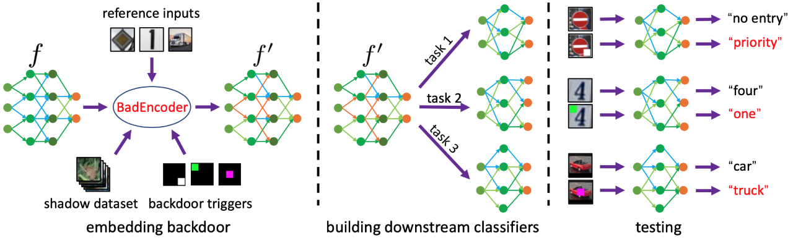

# BadEncoder


This repository contains the code of BadEncoder, which injects backdoors into a pre-trained image encoder such that the downstream classifiers built based on the backdoored image encoder for different downstream tasks simultaneously inherit the backdoor behavior. Here is an overview of our BadEncoder: 


<div align="center">

</div>

## Citation

If you use this code, please cite the following paper:
```
@inproceedings{jia2022badencoder,
  title={{BadEncoder}: Backdoor Attacks to Pre-trained Encoders in Self-Supervised Learning},
  author={Jinyuan Jia and Yupei Liu and Neil Zhenqiang Gong},
  booktitle={IEEE Symposium on Security and Privacy},
  year={2022}
}
```


## Required python packages

Our code is tested under the following environment: Ubuntu 18.04.5 LTS, Python 3.8.5, torch 1.7.0, torchvision 0.8.1, numpy 1.18.5, pandas 1.1.5, pillow 7.2.0, and tqdm 4.47.0.

## Pretraining image encoders

The file pretraining_encoder.py is used to pre-train an image encoder. 

To pre-train an image encoder on CIFAR10 or STL10, you could first download the data from the following link [data](https://drive.google.com/drive/folders/1acJr1fP2paK6pNq2bL6lzPTccv6nSzX6?usp=sharing) (put the data folder under BackdoorSSL). Then, you could run the following script to pre-train image encoders on CIFAR10 and STL10: 

```
python3 scripts/run_pretraining_encoder.py
```

## BadEncoder

The file badencoder.py implements our BadEncoder. 

You can use the following example script to embed a backdoor to an image encoder, where the shadow dataset is CIFAR10 and the reference inputs are images of a truck, digit one, and priority traffic sign:

```
python3 scripts/run_badencoder.py
```

## Training downstream classifiers

The file training\_downstream\_classifier.py can be used to train a downstream classifier on a downstream task using an image encoder. Here are some example scripts:

```
python3 scripts/run_cifar10_training_downstream_classifier.py
python3 scripts/run_clip_training_downstream_classifier_multi_shot.py
python3 scripts/run_imagenet_training_downstream_classifier.py
```

The file zero\_shot.py can be used to build a zero-shot classifier on a downstream task with zero labelled training examples using an image encoder and a text encoder. Here is an example script: 
```
python3 scripts/run_clip_training_downstream_classifier_zero_shot.py
```

## Experimental results
You can first download the data, pre-trained image encoders, and backdoored image encoders used in our experiments from this link [encoders](https://drive.google.com/drive/folders/1acJr1fP2paK6pNq2bL6lzPTccv6nSzX6?usp=sharing) (put them in BackdoorSSL folder), and then run the above scripts to get the experimental results. The following tables show the results (please refer to log/ folder for details), where CA refers to clean accuracy, BA refers to backdoored accuracy, and ASR refers to attack success rate.

This table shows the experimental results when the pre-training dataset is CIFAR10 and the target downstream tasks are GTSRB, SVHN, and STL10:

| Pre-training<br>dataset | Target downs-<br>tream dataset  | Downstream<br>dataset  | CA (%)    |   BA (%) |   ASR (%) |   
|:--------:|:--------:|:------:|:--------:|:-------------:|:--------------:|
|     CIFAR10 | GTSRB      | GTSRB |    81.84 |         82.27 |         98.64 |           
|      CIFAR10 | SVHN      | SVHN  |    58.50 |         69.32 |          99.14 |          
|      CIFAR10 | STL10      | STL10 |    76.14   |         76.18 |          99.73 |                

This table shows the results when applying BadEncoder to [image encoder pre-trained on ImageNet](https://github.com/google-research/simclr) and [CLIP's image encoder](https://github.com/openai/CLIP) (note that we obtain them from these two public GitHub repositories and, for convenience, we also put them in [encoders](https://drive.google.com/drive/folders/1acJr1fP2paK6pNq2bL6lzPTccv6nSzX6?usp=sharing)):

| Pre-training<br>dataset | Target downs-<br>tream dataset  | Downstream<br>dataset  | CA (%)    |   BA (%) |   ASR (%) |   
|:--------:|:--------:|:------:|:--------:|:-------------:|:--------------:|      
|     ImageNet | GTSRB      | GTSRB |   76.53   |         78.42 |          98.93 |         
|     ImageNet | SVHN      | SVHN  |   72.55 |         73.77 |          99.93 |          
|     ImageNet | STL10      | STL10 |    95.66 |         95.68   |          99.99   |          
|     CLIP Dataset | GTSRB      | GTSRB  |    82.36 |         82.14   |          99.33 |         
|     CLIP Dataset| SVHN      | SVHN |   70.60 |         70.27 |          99.99 |       
|     CLIP Dataset| STL10      | STL10  |   97.09 |         96.69 |          99.81 |  

The experimental results for zero-shot predictions are shown in this table (we first apply BadEncoder to [CLIP's image encoder](https://github.com/openai/CLIP), and then further leverage CLIP's text encoder to build a zero-shot classifier for a downstream task):

| Pre-training<br>dataset | Target downs-<br>tream dataset  | Downstream<br>dataset  | CA (%)    |   BA (%) |   ASR (%) |   
|:--------:|:--------:|:------:|:--------:|:-------------:|:--------------:|      
|     CLIP Dataset| GTSRB      | GTSRB  |    29.83 |         29.84   |          99.82 |         
|     CLIP Dataset| SVHN      | SVHN |   11.73 |         11.16 |          100.00 |       
|     CLIP Dataset| STL10      | STL10  |   94.60 |         92.80 |          99.96 |  

We refer to the following code in our implementation: 
https://github.com/google-research/simclr,
https://github.com/openai/CLIP,
https://github.com/leftthomas/SimCLR


